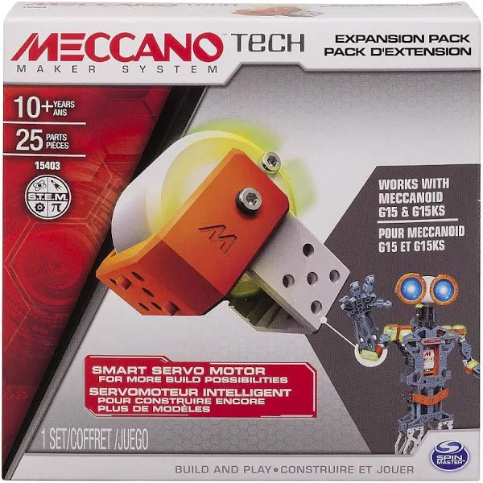
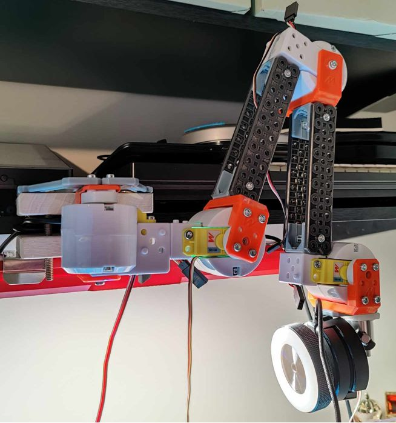
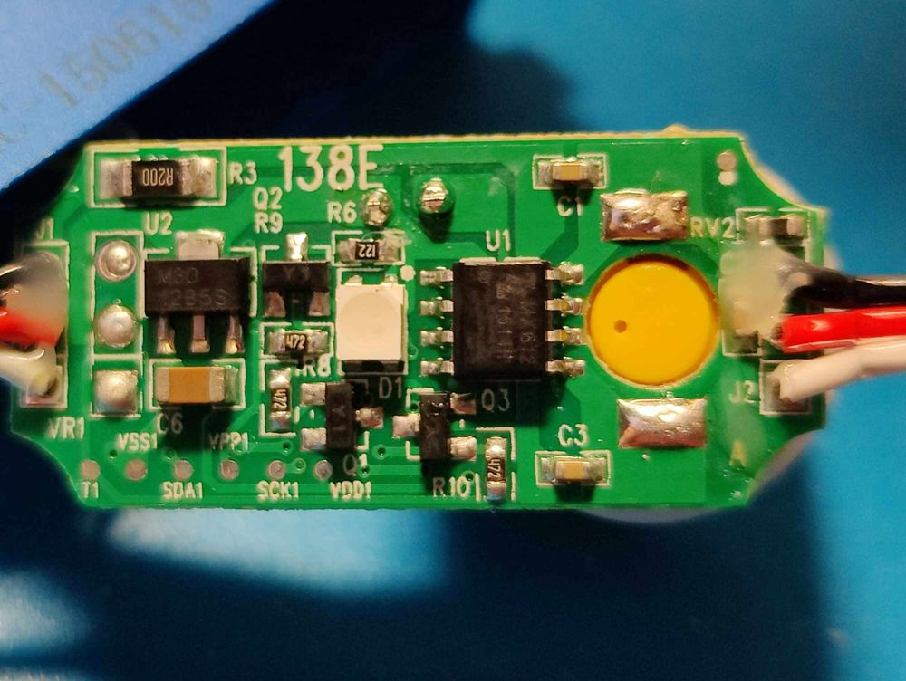
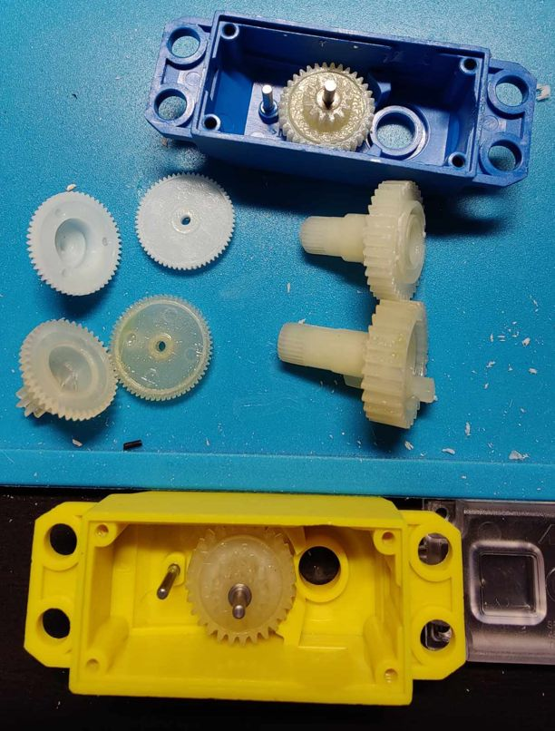

# Meccanoid Camera Rig

I really want a camera rig that I can position over my workspace if documentation is going to continue to be a priority.  Luckily, I'd picked up a couple of these Meccano Tech Meccanoid G15 Personal Robots from thrift stores over the years, as well as a pile of the replacement servos for the larger model from the Toys'R'Us bankruptcy, so let's see if I can just... make one.

<br/>
_These are $200 on Amazon, or $10 at your local thrift_

<br/>
_I think I got 6 of these at $5 each_

## Research

With very little digging, it turns out that Meccanoid provided open-source protocol specifications and an Arduino library back in 2015 - some of the links on the Arduino forums are dead, but [this link](http://intl.meccano.com/meccanoid-opensource) is the working one at time of writing.

I've provided them here with the understanding that they're not my intellectual property, but for posterity's sake:
- [Claw bot example project](resources/Claw_Bot_v2.zip)
- [Meccano Smart Module Protocol Spec](resources/Meccano_SmartModuleProtocols_2015.pdf)
- [Arduino Library](resources/meccanoid-library.zip)

They're really cool smart servos that use packetized info to allow you to daisy-chain 4 modules on the same bus.

## Feasibility Study

Getting a moving servo was pretty painless; I:
- Soldered pins onto a spare SparkFun ItsyBitsy I had lying around
- Pulled the connector off of the servo and tinned the ends
- Breadboarded them together per the PDF provided by Meccano
- Added the `.cpp` and `.h` files to my sketch
- Wrote the tiniest bit of test code

```C
#include "MeccaBrain.h"

MeccaBrain servo(13);

void setup() {
  Serial.begin(9600);
}

void loop() {
  Serial.println("Moving to 0deg");
  servo.setServoPosition(0, 0x00);
  servo.communicate();
  delay(3000);

  Serial.println("Moving to 180deg");
  servo.setServoPosition(0, 0xEF);
  servo.communicate();
  delay(3000);
}
```

A little bit of construction, and I had an entire camera rig.  However, one of the failings of these little servos is that they simply don't have enough torque to raise the camera.  If I coerced it into just the right position it would stay, but the weight of the rig would regularly cause the motor to over-current, resetting the controller.



My initial thought was to provide more power to the motors, so I started by driving them off of a second power supply, rather than just the 5V/0.5A coming off the USB that was powering the Arduino.  This helped slightly, but still wasn't enough power to allow the arms to lift with the camera attached.  Hooking up my multimeter inline, I could see the current spike just over 1A before the board reset and the servo went limp again.

## Ways Forward

### More Power

I could attempt to increase the voltage to the motor - this would decrease the lifespan of the motor, but could potentially provide a working solution for a time.  Ultimately, however, this would require an additional two lines of power to each servo, and I would have to figure out isolating power to the DC motor controller (pictured below, the 8-pin chip nearest the yellow circle - takes power, ground, and pwm, and applies voltage out to the correct motor pin to make it spin in the desired direction).  The other downfall is that the MX612 only runs up to around 9V, and if I had to pump up power, I'd ideally move to 12V.



### Sacrifice Speed for Torque

One thing I noticed while testing was that the servos still moved surprisingly fast for being positional - I could _potentially_ swap out the gearbox that's on the servo in order to increase the gear ratio, giving up a lot of that 'jerky' movement while also converting it into much-needed torque.  This is a pretty big engineering lift, however, as I would also have to relocate the position-sensing potentiometer, which would require a new case be printed, which makes the servo a different form factor requiring a new adapter into the Meccano line be printed... And if that's going to be the case, I could probably also swap the motors, and now we're almost at "3D print a servo."



### Buy Better Servos

Sure, probably could.

### Redesign

One thing I noticed while I was building was that I really liked the idea that I could manually adjust the camera rig and then lock it in place.  If I could find a way to replace the servos with an electro-mechanical locking elbow of some kind, that could be even better than what I made here with far less code.  Granted, this could be done with servos still, especially if I have to move toward custom servos.