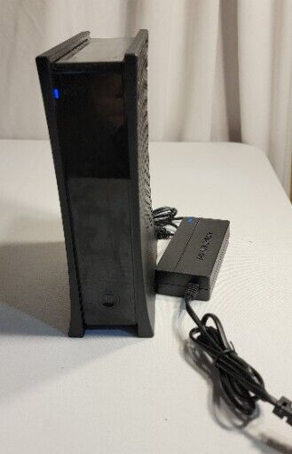
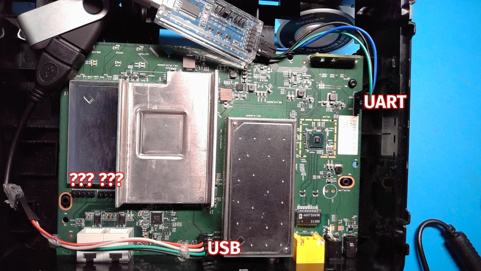
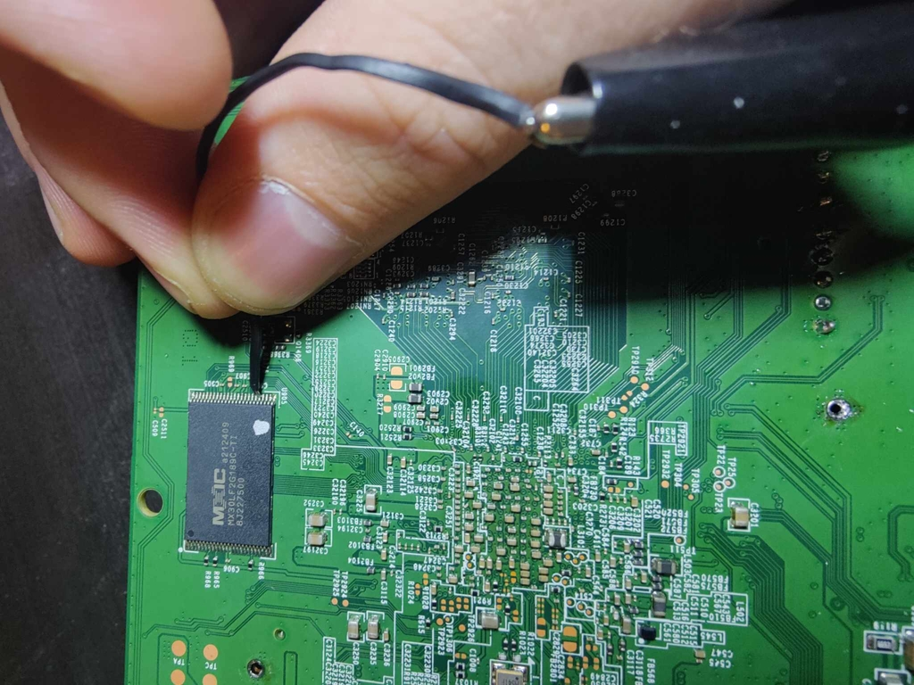

# Spectrum EU2251

Picked this bad boy up for $24.25 with shipping on eBay



Let's break it open

## Initial Investigation

`nmap` showed ports 80 and 443 as filtered, but otherwise provided no information when plugged in LAN-side

Pulling it open and probing around with PulseView, I pretty quickly found UART.  This picture was taken further into the process, so it also shows that while I didn't know it at the time, and while this device didn't have USB support out-of-the-box, there were working traces for USB.  Additionally, there were two sets of 5-pin headers very near the CPU/RAM that I haven't yet identified the use for.  I soldered pins to all of them for testing.



The flash chip is on the back (more on this later!), and other than that, we see a lot of remarks about "BCM3390" (understood to be the processor in use here)

Interestingly, while there's an FCC stamp, the FCC ID isn't listed on the device anywhere I can see.  Confirmed that the original manufacturer is Ubee on Spectrum's website


Also found a [datasheet](resources/SpectrumD31EMTA_New_Sheet.pdf)

### UART

Logging UART as I power it on, here are some interesting snippets:

```
    ,/    
  ,'/___, BOLT v4.01 v4.01_B1 LOCAL BUILD
.'__  ,'  (2019-08-12 09:39:08 ubee@ubee-VirtualBox-nb)
   /,'    Copyright (C) 2019 Broadcom Limited
  /'      

Board: BCM93390VVCM
```

BOLT bootloader, further confirming Ubee manufacture, and Broadcom chipset

Working back from this, we can find what appears to be an FCC filing for... perhaps a precursor to this same device?
- [Internal Photos](resources/fcc-internalphotos.pdf)
- [Charter User Manual](resources/fcc-usermanual.pdf)

Interestingly, the Charter user manual specifies that you can login from the LAN side, and that they login with `technician` and a generated "Password of the Day."  [More info about the Password of the Day, at least for Arris modems](https://arrispwgen.borfast.com/about)

```
Executing STARTUP...
Loader:raw Filesys:raw Dev:flash0.devtree1 File:(null) Options:(null)
Loading: ....
 65536 bytes read
Partition flash0.devtree1 size 262144
Searching for matching DTB
Found matching DTB rg.3390v0-vvcm.dtb
Loading DTB rg.3390v0-vvcm.dtb
Loader:zimg Filesys:raw Dev:flash0.kernel1 File:(null) Options:ubi.mtd=flash0.rg1 ubi.block=0,rootfs rootfstype=squashfs root=/dev/ubiblock0_0 ro platformboot ubifs_data coherent_pool=1M 
Reading 3400008 bytes from zImage...........
No OPPs generated by bolt
Starting program at 0x8000 (DTB @ 0x7627000)
```

```
[    0.000000] Linux version 4.9.248-Prod_21.2 (ubee@ubee-B560M-AORUS-ELITE) (gcc version 6.3.0 (crosstool-NG ) ) #9 SMP Thu Aug 25 11:21:18 CST 2022
```

```
[    1.432840] bcm7038-wdt f040a200.watchdog: Registered BCM7038 Watchdog
[    1.439760] bcm3390-wdt f040a100.watchdog: Registered bcm3390 watchdog
```

The [BCM7038](resources/BCM7038.PDF) is a video-related chip; it might not be present

```
starting pid 1404, tty '': '/etc/init.d/rcS'
Mounting virtual filesystems
==============================
CHIP:3390
MANUFACT_BITS: 5CC7
BOARD ID: 000000D0
SUBSYSTEM: rg
VFLASH: n
EXTENSION: 
KERNEL: vmlinuz-3390b0
STARTUP: BA=y RC=y AUTO=y
LATTICE: y
==============================
```

```
Mounting flash0.rgnonvol0 (mtd 10) to /data
```

Eventually, we're dropped to a normal Linux login prompt.

## Dumping the Firmware

Let's see if we can get access before Linux loads.  After I see the lightning bolt in the UART terminal...



I ground an IO pin on the flash chip, causing a communication error, and sure enough:

```
NAND: uncorrectable read error at 0x1600000

Could not load (null): Bad executable format
DT: error FDT_ERR_BADMAGIC
BOLT>
```

Bootloader shell.

I investigated a lot of potential options to get the firmware off the device, but ultimately ended up doing it the caveman way - I loaded the filesystem into memory, and then I scripted out using the bootloader's memory inspect feature to dump it in hexdump format over the serial connection:

```python
import serial

def read_until(ser, bstring):
    print(ser.read_until(bstring).decode())

def main(devpath):
    with serial.Serial(devpath, 115200) as ser:
        ser.write(b'\n')
        read_until(ser, b'BOLT>')

        for start_addr in [hex(x) for x in range(0x0a160000, 0x0ffc0000, 0x100000)]:
            ser.write(f'd -b {start_addr} 0x100000\n'.encode())
            chunk = ser.read_until(b'BOLT>')
            print(f'Writing outfile... {start_addr}')
            with open(f'dump-{start_addr}', 'wb') as outfile:
                outfile.write(chunk)

if __name__ == '__main__':
    # TODO: argparse
    main('/dev/ttyUSB0')
```

This took over 12 hours to complete for ~95MB, but with a little bit of `cat` and a little bit more `xxd -r`, I had a filesystem!

Despite my OS understanding that it was a UBI filesystem, it didn't know how to mount it, and so eventually I threw it at Emba to unpack, which it did, so now I could investigate the filesystem some.

## Execution

### Just Login

`root:$6$2PtwfEEJ$6wUOnAuSauNnTajWdpc5wYexlT6S.CuuMsZkWyNb4nbjHp1/iFEhDwDV2G/ztVsnfD/MaEzeVSpSyWkgnJBV6/:0:0:root:/root:/bin/sh`

Haven't found a matching password for the hash yet.

### USB Auto Upgrade

Turns out, there's a method to upgrade the device via USB; if `usbauto` is passed on the kernel commandline, there's an init script to mount a USB device and run `autorun.sh` off of it.

`/etc/init.d/rcS.util`:
```bash
	# If "usbauto" is specified on the command line, a USB auto upgrade
	# will be done.
	if $(grep -q usbauto /proc/cmdline)
	then
		USBAUTO=y
	else
		USBAUTO=n
	fi
```

`/etc/init.d/rcS.rg`:
```bash
# USB auto upgrade case
if [ "$USBAUTO" = "y" ]; then
	echo "Detected USB auto boot option"
	if [ -f /root/rc.user ]; then
		echo "Starting user services"
		/bin/sh /root/rc.user
	fi
fi
```

`/root/rc.user`:
```bash
grep usbauto /proc/cmdline > /dev/null
if [ $? -eq 0 ]; then
	#wait for usb stick to be recognized and mount it
	#by definition, update files must be in first partition of USB stick
	#First, try w/ no partition table (i.e. /dev/sda), then try the first
	#partition (i.e. /dev/sda1)
	mount_usb " " ${mountpoint}
	if [ $? -ne 0 ]
	then
		mount_usb 1 ${mountpoint}
		if [ $? -ne 0 ]
		then
			echo FAILED TO MOUNT USB STICK
			exit -1
		fi
	fi
	pushd ${mountpoint} > /dev/null
	./autorun.sh
```

This is actually the point where I realized that the four-pin header that I found was USB.  So in order to get execution, I:
- Wrote a FAT32 flash drive and put my `autorun.sh` script on there
- Soldered a USB-B connector onto the header and plugged my flash drive in
- Rebooted and shorted the flash again to return to the bootloader shell
- Appended `usbauto` to the kernel commandline in the STARTUP command
- Proved execution on the device by seeing this in the terminal during bootup:

```
================================================================================
        ____________________________________________________                    
       /                                                    |___________        
      /  #  ##   ####  ####    ###   #  ##  #####   ###     |   __      |       
     (   #  ##  #      #  ##  #  ##  #  ##    ##   #  ##    |  |__|     |       
     |   #  ##   ###   ####   #####  #  ##    ##   #  ##    |           |       
     |   #  ##     ##  #  ##  #  ##  #  ##    ##   #  ##    |   __      |       
     (   #####  #  ##  #  ##  #  ##  #####    ##   #  ##    |  |__|     |       
      \   ###    ###   ####   #  ##   ###     ##    ###     |___________|       
       \____________________________________________________|                   
                                                                                
================================================================================
```

## Shell

### Just Login

I didn't actually try replacing `/etc/passwd` for a couple of reasons:
- I wanted to touch the filesystem as little as possible, I don't want to find out I've missed a secure boot check and have to figure out re-flashing the device
- It may not have worked for a few different reasons (order of operations, read-only filesystems, etc)

So I went searching.  I attempted to spin up `telnetd` from busybox, but for some reason I could never get in (more on that later).  I figured maybe my `iptables` rules were getting squashed further down in the init, so I went looking for more ways in.  I found a much more persistent method further down the init chain:

`/usr/local/etc/rc.apps`
```bash
# start ste script
STE_SCRIPT_PATH_FILE=/data/ste_script
if [ -f $STE_SCRIPT_PATH_FILE ]; then
    STE_SCRIPT=$(cat $STE_SCRIPT_PATH_FILE)
    if [[ ! -z "$STE_SCRIPT" ]]; then
        echo "Executing STE script file: $STE_SCRIPT_PATH_FILE"
        source $STE_SCRIPT_PATH_FILE
    fi
fi
```

So I used USBAUTO to drop a script there that should have spun up `telnetd` and... still nothing.  Weird.  So I kept looking for what could have caused it, when I came across the way in I used for most of my device interrogation:

### Don't Bother Logging In

`/etc/inittab`:
```bash
#_ BAM a shell before we init, because we never want to be caught with
#_ our shell down.
#ttyS0::respawn:/sbin/getty -L 115200 ttyS0 vt102
::respawn:/bin/cttyhack /bin/loginscript.sh

# main rc script
::sysinit:/etc/init.d/rcS

# Stuff to do before rebooting
null::shutdown:/bin/umount -a -r
```

`/bin/loginscript.sh`:
```bash
#!/bin/bash

NOLOGIN=/data/.nologin

if [ -f "$NOLOGIN" ]; then
	/bin/cttyhack /bin/sh -l
else
	/sbin/getty -L 115200 ttyS0 vt102
fi
```

Basically, the shell we're given is decided by `loginscript.sh` - but if `/data/.nologin` exists, it'll just pass us `/bin/sh` over BusyBox's `cttyhack` (which takes care of TTY allocation).  So with USBAUTO adjusted slightly to go ahead and `touch /data/.nologin`, we get the following over UART now when we connect:

```
[3390:RG]# whoami
root
[3390:RG]#
```

# Active Project

Work is ongoing on this project, stay tuned for updates!