# Tenda RX2 Pro Dual-Band Gigabit Wi-Fi 6 Router Security Research

Matt 'uturn' Evans, Security Researcher

## Contents

- [Tenda RX2 Pro Dual-Band Gigabit Wi-Fi 6 Router Security Research](#tenda-rx2-pro-dual-band-gigabit-wi-fi-6-router-security-research)
  - [Contents](#contents)
  - [Summary](#summary)
  - [Environment, Motive, and Likely Anti-RE Efforts](#environment-motive-and-likely-anti-re-efforts)
  - [Client-Server Communication Vulnerabilities](#client-server-communication-vulnerabilities)
    - [CVE-2025-46634: Transmission of Plaintext Credentials in httpd](#cve-2025-46634-transmission-of-plaintext-credentials-in-httpd)
    - [CVE-2025-46632: Static IV Use in httpd](#cve-2025-46632-static-iv-use-in-httpd)
    - [CVE-2025-46633: Transmission of Plaintext Symmetric Key in httpd](#cve-2025-46633-transmission-of-plaintext-symmetric-key-in-httpd)
  - [Accessing Resources from the Guest Network](#accessing-resources-from-the-guest-network)
    - [CVE-2025-46635: Improper Network Isolation](#cve-2025-46635-improper-network-isolation)
  - [First Path to Root Shell: Telnet](#first-path-to-root-shell-telnet)
    - [CVE-2025-46631: Enable telnet Unauthenticated through httpd](#cve-2025-46631-enable-telnet-unauthenticated-through-httpd)
    - [CVE-2025-46627: Calculated OS root Password](#cve-2025-46627-calculated-os-root-password)
  - [Second Path to Root Shell: ate](#second-path-to-root-shell-ate)
    - [CVE-2025-46630: Enable ate Unauthenticated through httpd](#cve-2025-46630-enable-ate-unauthenticated-through-httpd)
    - [CVE-2025-46629: Lack of Authentication in ate](#cve-2025-46629-lack-of-authentication-in-ate)
    - [CVE-2025-46626: Poor Crypto in ate](#cve-2025-46626-poor-crypto-in-ate)
    - [CVE-2025-46628: Command Injection through ifconfig command in ate](#cve-2025-46628-command-injection-through-ifconfig-command-in-ate)
  - [Third Path to Root Shell: Command Inject](#third-path-to-root-shell-command-inject)
    - [CVE-2025-46625: Command Injection through setLanCfg in httpd](#cve-2025-46625-command-injection-through-setlancfg-in-httpd)

## Summary

Eleven vulnerabilities in the Tenda RX2 Pro Dual-Band Gigabit Wi-Fi 6 Router V16.03.30.14 were discovered and disclosed to Tenda, though no response was received so no path to remediation exists at the time of writing.  Combinations of these vulnerabilities would allow an attacker connected to the device, even through the normally-segregated guest network, multiple paths to gain root shell with low technical effort.

This report details some of the (presumably) anti-RE efforts that were encountered, vulnerabilities in the web server's client-server communication, a vulnerability that allows guest network members access to primary network resources, and multiple paths to root shell on the device.

## Environment, Motive, and Likely Anti-RE Efforts

Originally, my intention was to acquire multiple Tenda firmwares to work on getting better at QEMU emulation, which was when I found that most current Tenda devices now used encrypted firmware blobs.  I attempted to find an intermediary firmware image - one where they would have "upgraded" a device to accept encrypted firmware blobs, mandating that itself be unencrypted but contain the process to decrypt images - but I was unsuccessful.  I then identified the RX2 Pro as one of the cheaper devices that was using encrypted firmware blobs and procured one.

Despite update images being encrypted, firmware on the device's flash was not.  I was able to dump the flash by lifting the chip and reading it on my CH341A, obtaining a packed root partition from one of the partitions.

The packed root partition was using a mangled version of SquashFS - one where they change all the magic bytes and CRC polynomials - but also one I had seen before with my research on the Tenda W18E, which I hope to cover in a blog post in the future.  Using that same tooling, I was able to unpack the root partition in order to bolster my dynamic analysis efforts with static analysis of the binaries running on-device.

With a copy of the root partition, I was also able to identify and begin reverse-engineering their update firmware decryption method, but that too will have to wait for a future blog post.

## Client-Server Communication Vulnerabilities

The web management portal for the RX2 Pro implements encryption for some of its traffic instead of using GoAhead's existing TLS/SSL support.  Three vulnerabilities were discovered in their implementation, however, that make it ineffective.

### CVE-2025-46634: Transmission of Plaintext Credentials in httpd

> Cleartext transmission of sensitive information in the web management portal of the Tenda RX2 Pro V16.03.30.14 may allow an unauthenticated attacker to authenticate to the web management portal by collecting credentials from collected and/or observed traffic.

The web management portal doesn't begin encrypting communication until after authentication - which means the user transmits credentials in plaintext over HTTP, including when Remote Management is enabled and this behavior is happening on the WAN side of the router.  While the user is only transmitting the hash of the password, the hash can be replayed in order to provide authentication.

Wireshark traffic of the authentication process:

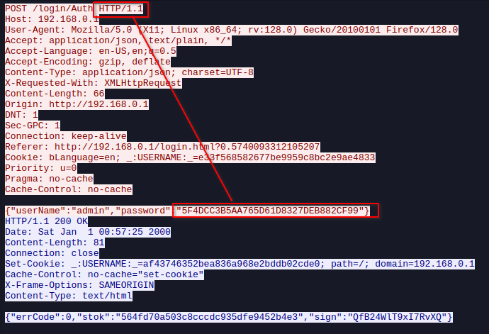

Indication that this is just an MD5 hash of the user-provided password:

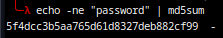

### CVE-2025-46632: Static IV Use in httpd

> Initialization vector (IV) reuse in the web management portal of the Tenda RX2 Pro V16.03.30.14 may allow an attacker to discern information about or more easily decrypt encrypted messages between client and server.

The web management portal uses AES-128-CBC to encrypt traffic after authentication, but re-uses the same IV ("EU5H62G9ICGRNI43") for every session.

Here's the Ghidra decompilation showing the call to `EVP_DecryptInit_ex` for an AES-128-CBC context from inside a wrapper function:

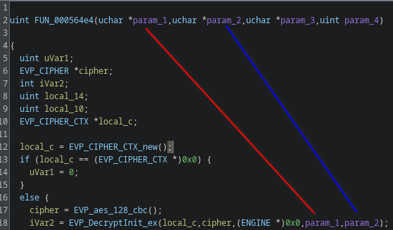

Here's the manpage entry for `EVP_DecryptInit_ex` showing that key and IV are the last two arguments passed in:

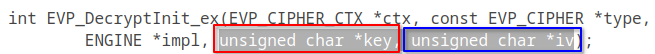

And here's the Ghidra decompilation showing the call to the wrapper function with the static IV:

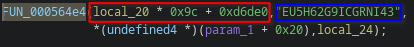

### CVE-2025-46633: Transmission of Plaintext Symmetric Key in httpd

> Cleartext transmission of sensitive information in the web management portal of the Tenda RX2 Pro V16.03.30.14 allows an attacker to decrypt traffic between the client and the server by collecting the symmetric AES key from collected and/or observed traffic.

The web management portal uses AES-128-CBC to encrypt traffic after authentication, but sends the AES key in plaintext to the client upon successful authentication.  Any attacker able to collect encrypted traffic would also be able to collect the handshake with the key and therefore decrypt any traffic collected.

Wireshark traffic showing the returned AES key:

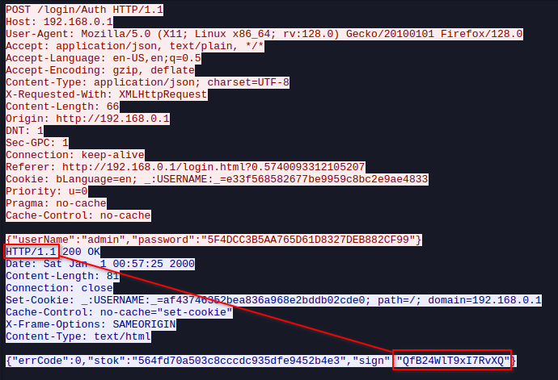

Wireshark traffic showing base64-encoded encrypted data:

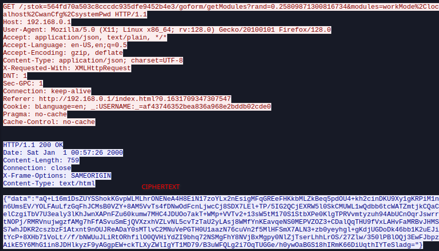

Decoding and decrypting the traffic in GCHQ's CyberChef:

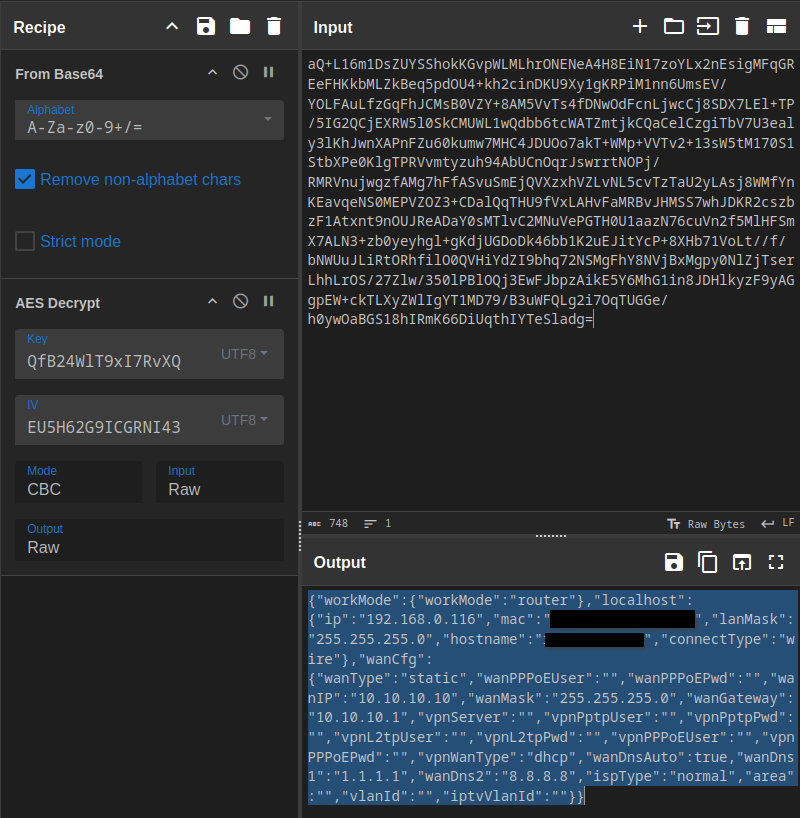

## Accessing Resources from the Guest Network

### CVE-2025-46635: Improper Network Isolation

> Improper network isolation between the guest WiFi network and other network interfaces allows an attacker authenticated to the guest WiFi network to access resources on the router and resources and devices on other networks hosted by the router

The RX2 Pro only uses subnetting to separate primary and guest WiFi networks, meaning an attacker on the guest network is still layer-2-adjacent to the rest of the network, and is not blocked from scanning the primary network.  The only rule I observed blocks the guest subnet from accessing specific ports on the device, but this is easily bypassed if the attacker changes their IP address to be inside the primary subnet (which can be obtained through ARP traffic).

## First Path to Root Shell: Telnet

It is possible for an unauthenticated remote attacker to enable telnet on the device and login as root using a password generated from easily-obtained information.

### CVE-2025-46631: Enable telnet Unauthenticated through httpd

> Improper access controls in the web management portal of the Tenda RX2 Pro V16.03.30.14 allows an unauthenticated remote attacker to enable telnet access to the router's OS by sending a web request.

The web management portal for the Tenda RX2 Pro has a whitelist of URLs that can be reached without authentication, one of these being `/goform/telnet`, which enables the console on the OS and starts a telnet listener.  As far as I was able to find, this endpoint is not documented or made available to the user elsewhere in the web management portal.

Ghidra decompilation of `gh_check_web_request_white_list` in `libgo.so`:

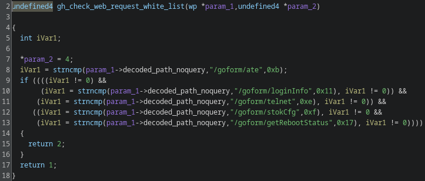

Turning on telnet via curl, no passwords or cookies:

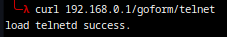

### CVE-2025-46627: Calculated OS root Password

> Use of weak credentials in the Tenda RX2 Pro V16.03.30.14 allows an unauthenticated attacker to authenticate to the telnet service by calculating the root password based on easily-obtained device information.

The root password for the Tenda RX2 Pro V16.03.30.14 is changed on-boot to a password calculated based on the last two digits/octets of the MAC address.

Ghidra decompilation of `cnsl_safe` showing the password generation algorithm and system cmd to set it via `passwd`:

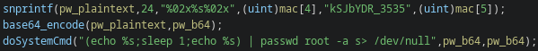

## Second Path to Root Shell: ate

It is possible for an unauthenticated remote attacker to enable an undocumented management feature on the router that does not require authentication and that is vulnerable to command injection.

There is a router configuration service named `ate` that enables configuration reset of the router, remote reboot of the router, remote ifconfig commands to be run, and more.  Once running, there is no authentication to send commands to `ate`.  Additionally, while `ate` vulnerabilities have been published before, the version on the RX2 Pro has added a layer of cryptography to its command sending and receiving; while I could speculate on the purpose of this encryption, the implementation is no good, and was similarly reported.

### CVE-2025-46630: Enable ate Unauthenticated through httpd

> Improper access controls in the web management portal of the Tenda RX2 Pro V16.03.30.14 allows an unauthenticated remote attacker to enable `ate`, a system management binary that can be accessed over the network, by sending a web request.

The web management portal for the Tenda RX2 Pro has a whitelist of URLs that can be reached without authentication, one of those being `/goform/ate`, which starts the `ate` binary to listen on port 7329/udp.  As far as I was able to find, this endpoint is not documented or made available to the user elsewhere in the web management portal.

Ghidra decompilation of `gh_check_web_request_white_list` in `libgo.so`:

Enabling `ate` via curl, no passwords or cookies:

### CVE-2025-46629: Lack of Authentication in ate

> Lack of access controls in the `ate` management binary of the Tenda RX2 Pro V16.03.30.14 allows an unauthenticated remote attacker to perform unauthorized configuration changes for any router where `ate` has been enabled by sending a crafted UDP packet.

Despite presumably being used for device configuration, despite its undocumented nature, it requires no authentication to use.  Once the service is running, it accepts any commands that land at 7329/udp.

### CVE-2025-46626: Poor Crypto in ate

> Reuse of a static key and IV for encrypted traffic to the `ate` management binary of the Tenda RX2 Pro V16.03.30.14 allows an attacker to decrypt, replay, and/or forge traffic to the device.

The `ate` service uses a static key ("Tenda0123456789M") and IV (16 null bytes) to decrypt a received message.

### CVE-2025-46628: Command Injection through ifconfig command in ate

> Lack of input validation/sanitization in `ate` in the Tenda RX2 Pro V16.03.30.14 allows an unauthorized remote attacker to gain root shell access to the device by sending a crafted UDP packet to the `ate` service when enabled

Sending an `ifconfig` command to the `ate` service sees it appending user-input data to an `ifconfig` command that it executes, allowing an attacker to inject additional commands.

Ghidra decompilation of a portion of the `ifconfig` handler in `ate`:

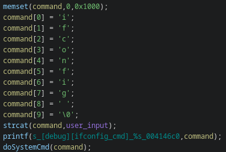

## Third Path to Root Shell: Command Inject

### CVE-2025-46625: Command Injection through setLanCfg in httpd

> Lack of input validation/sanitization in the `setLanCfg` API endpoint in httpd in the Tenda RX2 Pro 16.03.30.14 allows a remote attacker that is authorized to the web management portal to gain root shell access to the device by sending a crafted web request.  This is persistent because the command injection is saved in the device configuration.

It is possible for an attacker with access to the web management portal to set a value in the device's configuration that is later used in a system command, both while running and on reboot.