# Tenda W18E Security Research

Matt Evans, Independent Researcher

Published in coordination and collaboration with Reddas Solutions

[The Original Posting on the Reddas Solutions Blog](https://reddassolutions.com/blog/tenda_w18e_security_research)

Updated 11 February with associated CVEs and corrected CWEs

## Contents

- [Tenda W18E Security Research](#tenda-w18e-security-research)
  - [Contents](#contents)
  - [Initial Research](#initial-research)
    - [Firmware Acquisition](#firmware-acquisition)
    - [Prior Proof of Concept (PoC) Acquisition/Development](#prior-proof-of-concept-poc-acquisitiondevelopment)
  - [Expanding CVEs 2023-46369 and 2023-46370](#expanding-cves-2023-46369-and-2023-46370)
    - [CVE-2023-46369 - Stack Overflow in `portMirrorMirroredPorts`](#cve-2023-46369---stack-overflow-in-portmirrormirroredports)
    - [CVE-2023-46370 - Command Inject in `formSetNetCheckTools`](#cve-2023-46370---command-inject-in-formsetnetchecktools)
  - [No-Auth](#no-auth)
    - [CVE-2024-46434: `initAdminUser` Authentication Bypass (High/8.8)](#cve-2024-46434-initadminuser-authentication-bypass-high88)
    - [CVE-2024-46432: `setQuickCfgWifiAndLogin` Unauthorized Configuration Change (High/8.8)](#cve-2024-46432-setquickcfgwifiandlogin-unauthorized-configuration-change-high88)
    - [CVE-2024-46437: `getQuickCfgWifiAndLogin` Sensitive Information Disclosure (Medium/6.5)](#cve-2024-46437-getquickcfgwifiandlogin-sensitive-information-disclosure-medium65)
    - [CVE-2024-46430: `setLoginPassword` Unauthorized Password Change (Medium/6.5)](#cve-2024-46430-setloginpassword-unauthorized-password-change-medium65)
  - [Default Auth](#default-auth)
    - [CVE-2024-46429: Hardcoded `guest` Credentials with Privileged Access (High/8.8)](#cve-2024-46429-hardcoded-guest-credentials-with-privileged-access-high88)
    - [CVE-2024-46433: Default `rzadmin` Credentials (High/8.8)](#cve-2024-46433-default-rzadmin-credentials-high88)
    - [CVE-2024-46436: Hardcoded `telnet` Credentials with Privileged Access (High/8.3)](#cve-2024-46436-hardcoded-telnet-credentials-with-privileged-access-high83)
  - [Additional Stack-Bashing](#additional-stack-bashing)
    - [CVE-2024-46431: `delWewifiPic` Stack Overflow (High/8.0)](#cve-2024-46431-delwewifipic-stack-overflow-high80)
    - [CVE-2024-46435: `delFacebookPic` Stack Overflow (High/8.0)](#cve-2024-46435-delfacebookpic-stack-overflow-high80)

## Initial Research

I acquired a Tenda W18E AC1200 Gigabit Wireless Hotspot Router from eBay for $60, running firmware v1625.  Two previous CVEs were published for firmware v1576: CVE-2023-46369 (a stack overflow vulnerability) and CVE-2023-46370 (a command injection vulnerability).  Notably, Tenda no longer offers firmware v1576 on their support download page.  Additionally, these vulnerabilities were originally disclosed by Github user Archerber, but the original disclosure at https://github.com/Archerber/bug_submit has since been deleted.

### Firmware Acquisition

I acquired firmware images for versions v1449 (dated 2019-07-31), v1625 (dated 2020-05-30), and v2866 (dated 2021-12-24) directly from Tenda's support site.  Through additional research, I was also able to obtain v1576.  The firmware was obfuscated, presenting as uImage files with squashfs root partitions but using custom LZMA magic bytes and CRC polynomials.  In order to extract them, I modified [squashfs-tools](https://github.com/plougher/squashfs-tools) and [xz](https://chromium.googlesource.com/chromium/deps/xz) to use the custom LZMA magic bytes and ignore CRC checks altogether, chaining them together with LD_PRELOAD.  This successfully gave me the kernel and rootfs partition for all four firmware versions I'd acquired.

### Prior Proof of Concept (PoC) Acquisition/Development

I recovered the information deleted from Archerber's git repo, but with it being unlicensed, will refrain from posting their PoCs here.  Using the information obtained, I developed a PoC for CVE-2023-46370 and found that it still applied to the firmware on my router (v1625).  This vulnerability allowed me to open telnet, gain a root shell, and use the included busybox on-device to transfer files via tftp.

At different stages during my research, in an effort to better the research environment, I deployed a statically-compiled gdbserver for MIPS, as well as httpd binaries for all four firmware versions to the router.

## Expanding CVEs 2023-46369 and 2023-46370

### CVE-2023-46369 - Stack Overflow in `portMirrorMirroredPorts`

This is caused by a bad `sprintf` in the function that handles `setPortMirror` data for the `/goform/module` endpoint, which (in this case) requires an authorized user.  

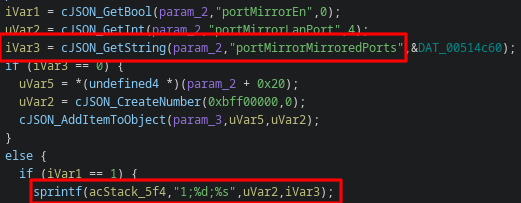

Furthermore, I was able to successfully control the return address, meaning that this is guaranteed to be able to cause RCE.

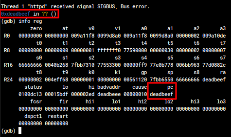

I was able to confirm that this applies to all four firmware versions I obtained, relevant CPEs below:

- Already disclosed
  - cpe:2.3:h:tenda:w18e:1.0:*:*:*:*:*:*:*
  - cpe:2.3:&zwnj;o:tenda:w18e_firmware:16.01.0.8\(1576\):*:*:*:*:*:*:*
- Suggested to be added
  - cpe:2.3:&zwnj;o:tenda:w18e_firmware:16.01.0.7\(1449\):*:*:*:*:*:*:*
  - cpe:2.3:&zwnj;o:tenda:w18e_firmware:16.01.0.8\(1625\):*:*:*:*:*:*:*
  - cpe:2.3:&zwnj;o:tenda:w18e_firmware:16.01.0.9\(2866\):*:*:*:*:*:*:*

### CVE-2023-46370 - Command Inject in `formSetNetCheckTools`

This is caused by moving user data into a `popen` via `sprintf` in the function that handles `setFixTools` data for the `/goform/module` endpoint, which (in this case as well) requires an authorized user.

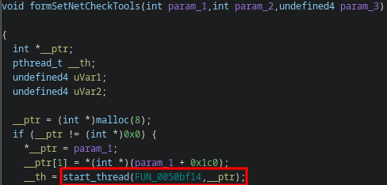

There is an attempt to filter command inject data, but it only guards against `;`, `&`, and `|`, ignoring command substitution entirely.

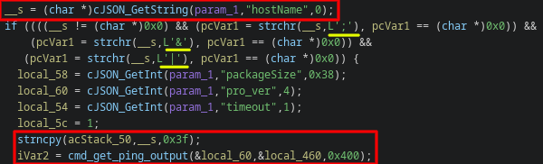

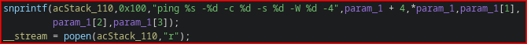

I was able to confirm that this applies to all four firmware versions I obtained, relevant CPEs below:

- Already disclosed
  - cpe:2.3:h:tenda:w18e:1.0:*:*:*:*:*:*:*
  - cpe:2.3:o:tenda:w18e_firmware:16.01.0.8\(1576\):*:*:*:*:*:*:*
- Suggested to be added
  - cpe:2.3:o:tenda:w18e_firmware:16.01.0.7\(1449\):*:*:*:*:*:*:*
  - cpe:2.3:o:tenda:w18e_firmware:16.01.0.8\(1625\):*:*:*:*:*:*:*
  - cpe:2.3:o:tenda:w18e_firmware:16.01.0.9\(2866\):*:*:*:*:*:*:*

## No-Auth

Every request passes through `authSecurityHandler` to determine if logon is needed or not.  This passes on all `/goform/module` requests, which is the API that underpins the entire system, to have auth handled at a later stage.

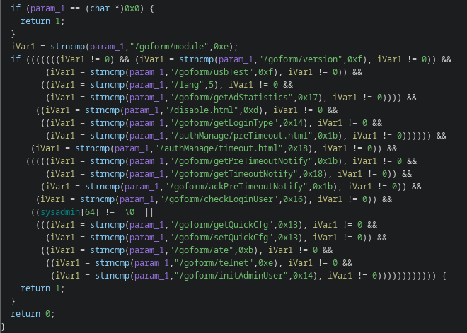

The way Ghidra disassembles it doesn't make a ton of sense, but it results in the following truth table (0 means no auth needed):
```
/goform/module	            0
/goform/usbTest	            0
/lang	                    0
/goform/getAdStatistics	    0
/disable.html	            0
/goform/getLoginType	    0
/authManage/preTimeout.html	0
/goform/getPreTimeoutNotify	0
/goform/getTimeoutNotify	0
/goform/ackPreTimeoutNotify	0
/goform/checkLoginUser	    0
/goform/getQuickCfg	        1
/goform/ate	                1
/goform/telnet	            1
/goform/initAdminUser	    1
```

That later stage, however, first checks if the user is logged in (by way of their IP address and a blank cookie), and if they're not, checks the JSON payload of the request against a hard-coded list of endpoints that don't require auth.

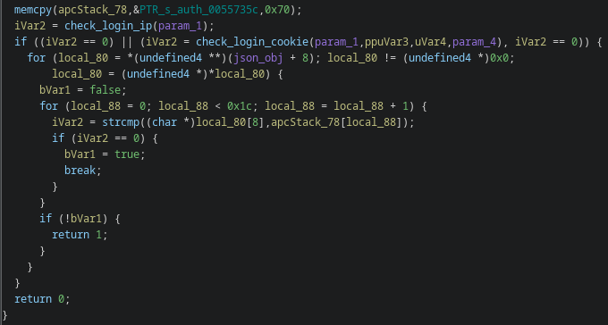

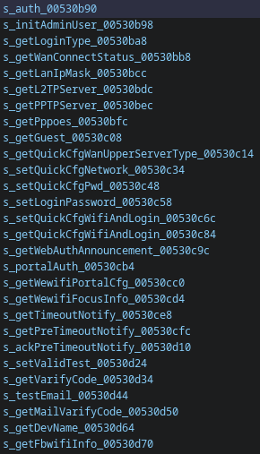

This creates a landslide of different impacts based on which endpoint is used, detailed here:

### CVE-2024-46434: `initAdminUser` Authentication Bypass (High/8.8)

An unauthorized actor with access to the web management portal can bypass authentication entirely.

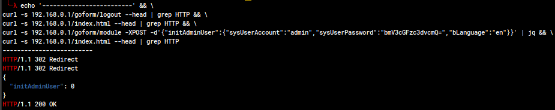

The first two `curl` commands are to show that the device doesn't simply remember my IP and have me logged in already; the third is the exploit, and the fourth shows that the device believes we're logged in.  This can also be seen in the Ghidra decompilation of the handling function.

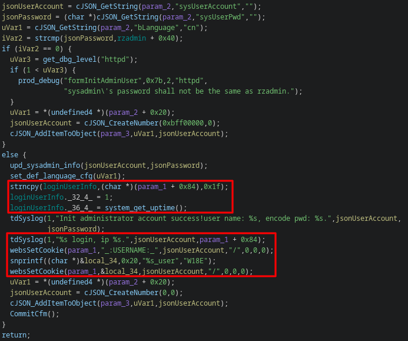

### CVE-2024-46432: `setQuickCfgWifiAndLogin` Unauthorized Configuration Change (High/8.8)

An unauthorized actor with access to the web management portal can change the WiFi SSID, WiFi auth method and password, and the administrator user password.  This also logs the user in, bypassing authentication.

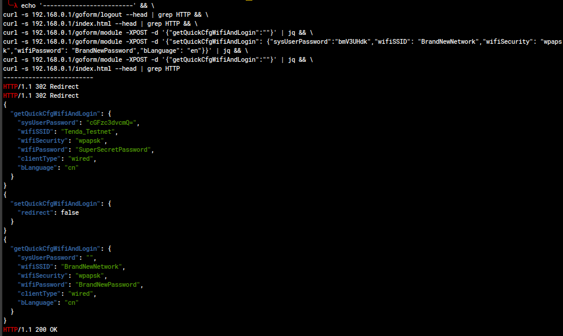

### CVE-2024-46437: `getQuickCfgWifiAndLogin` Sensitive Information Disclosure (Medium/6.5)

An unauthorized actor with access to the web management portal can recover information about the running configuration, including WiFi SSID, WiFi password, and the administrator user credentials (base64-encoded).

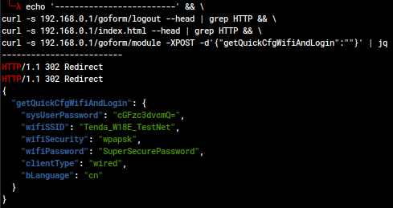

### CVE-2024-46430: `setLoginPassword` Unauthorized Password Change (Medium/6.5)

An unauthorized actor with access to the web management portal can change the administrator password.

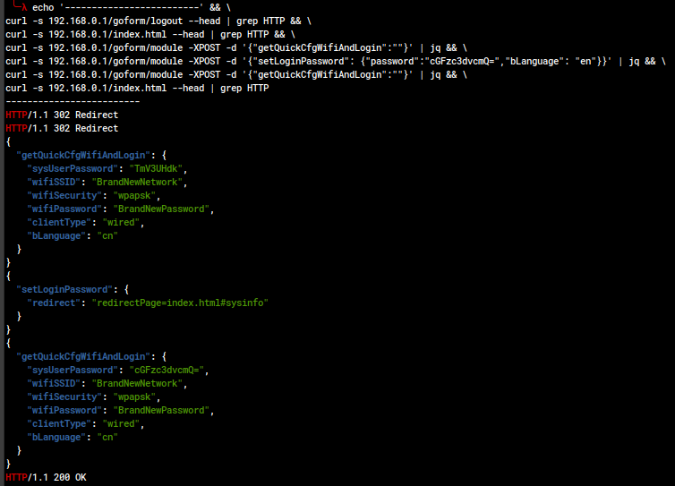

## Default Auth

In addition to auth being missing for many API endpoints, there's also a significant issue with default, easily-guessable credentials.

### CVE-2024-46429: Hardcoded `guest` Credentials with Privileged Access (High/8.8)

In all firmware versions, there is a default `guest` account with the password `guest`.  In firmware versions v1449, v1576, and v1625, there is no indicator to the administrator that this account exists and there is no method presented by the software to change the guest password.  The guest account, despite its name, is an admin account, and is fully-featured to make changes and read passwords.  Patch notes state that Tenda fixed the issue of it not appearing in the GUI in v2866, but what really happened is they removed the guest account from the default configuration.

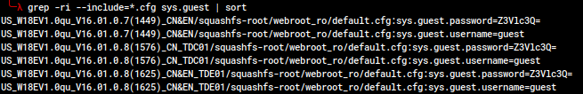

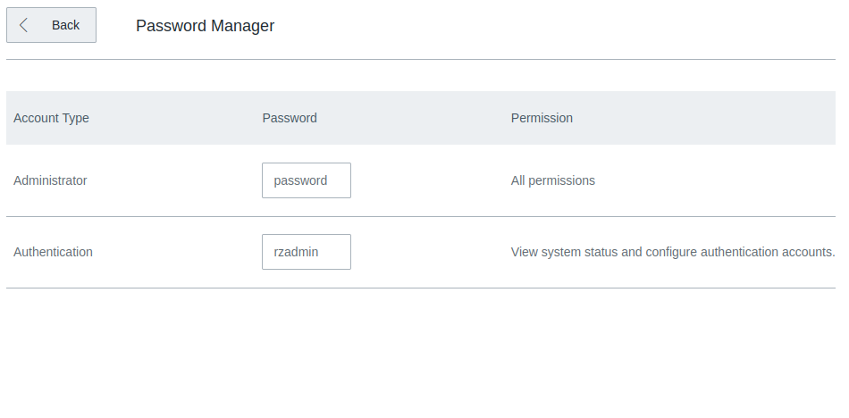

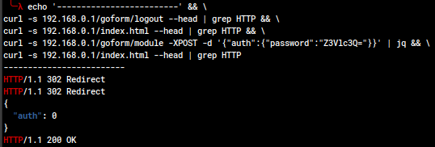

### CVE-2024-46433: Default `rzadmin` Credentials (High/8.8)

In all firmware versions, there is a default `rzadmin` account with the password `rzadmin`.  The user is not prompted to change this account password during setup, and would only see that it exists via the Password Manager screen.  While the GUI for this user is limited, it is actually another admin account with full access to the API, which, among other things, allows it to read the administrator password.

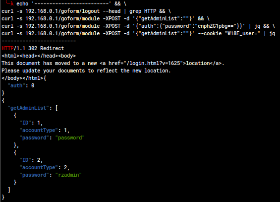

### CVE-2024-46436: Hardcoded `telnet` Credentials with Privileged Access (High/8.3)

While telnet is not on by default, once enabled, the root user's password is `Fireitup`.  These credentials have been used on a number of other Tenda devices, are easily discovered on the internet, and cannot be changed on the device.

## Additional Stack-Bashing

CVE-2023-46369 isn't the only memory-unsafe function that takes user input over the network.

### CVE-2024-46431: `delWewifiPic` Stack Overflow (High/8.0)

An authorized actor with access to the web management portal can cause a stack overflow, caused by using `sprintf` to copy user data into a statically-sized stack buffer.

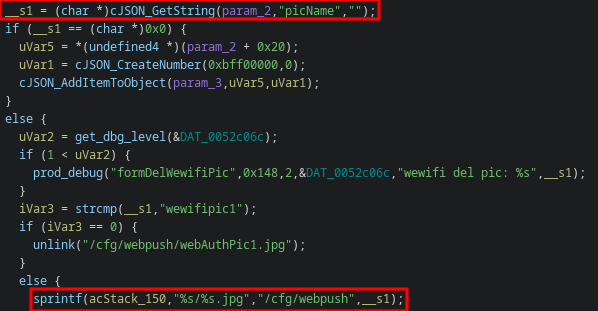

I wasn't able to control the return address as neatly on this one as I was with CVE-2023-46369, but I don't think it would be a stretch to turn this into RCE.

### CVE-2024-46435: `delFacebookPic` Stack Overflow (High/8.0)

An authorized actor with access to the web management portal can cause a stack overflow, caused by using `sprintf` to copy user data into a statically-sized stack buffer.

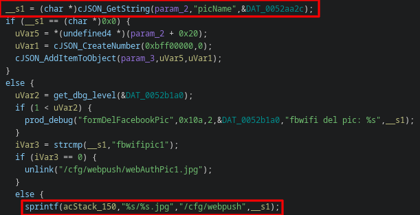

This one is almost identical to the `delWewifiPic`, down to how hard it was to control the return address appropriately.

